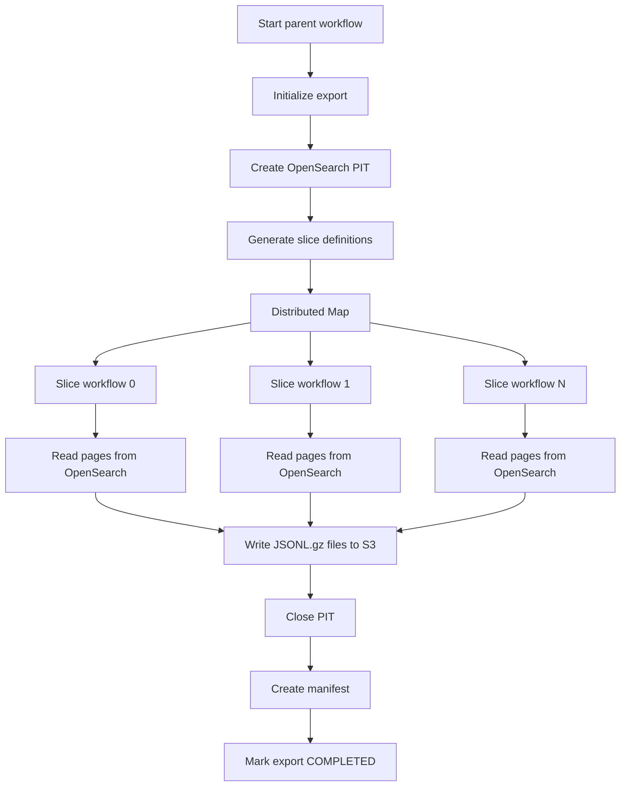

# OpenSearch Export Pipeline

A production-oriented AWS pipeline for exporting large datasets from Amazon OpenSearch Service to Amazon S3.

The pipeline uses AWS Lambda and AWS Step Functions to split an OpenSearch query into independent slices, process those slices in parallel, and store the resulting dataset as compressed JSON Lines files in S3.

## Key features

- Consistent OpenSearch exports using Point in Time
- Deep pagination using `search_after`
- Parallel processing using OpenSearch search slicing
- AWS Step Functions Distributed Map orchestration
- Controlled concurrency to protect OpenSearch
- Idempotent S3 object naming
- Export job tracking in DynamoDB
- Automatic retry of temporary failures
- Export manifest generation
- Private VPC connectivity
- S3 and DynamoDB Gateway VPC endpoints
- CloudWatch logs and alarms
- Terraform-managed AWS infrastructure

## Architecture



## AWS components

| Component | Responsibility |
|---|---|
| Amazon OpenSearch Service | Source of indexed documents |
| AWS Lambda | Reads OpenSearch pages and writes files to S3 |
| AWS Step Functions | Orchestrates initialization, slices, cleanup, and finalization |
| Distributed Map | Processes OpenSearch slices in parallel |
| Amazon S3 | Stores exported data files and the final manifest |
| Amazon DynamoDB | Stores export status and idempotency metadata |
| Amazon CloudWatch | Stores logs, metrics, and alarms |
| Amazon VPC | Provides private access between Lambda and OpenSearch |

## Export strategy

The pipeline does not use `from` and `size` for deep pagination.

Instead, it uses:

1. Point in Time to keep the exported dataset consistent.
2. Search slicing to divide the dataset into independent parts.
3. `search_after` to read pages sequentially within each slice.
4. Distributed Map to process multiple slices concurrently.

Different slices are processed in parallel, while pages inside one slice are processed sequentially.

```text
Slice 0: page 0 → page 1 → page 2
Slice 1: page 0 → page 1 → page 2
Slice 2: page 0 → page 1 → page 2
```

## Project structure

```text
opensearch_export_pipeline/
├── README.md
├── pyproject.toml
├── requirements.txt
├── requirements-lambda.txt
│
├── src/
│   └── export_pipeline/
│       ├── common/
│       │   ├── config.py
│       │   ├── job_store.py
│       │   ├── models.py
│       │   ├── opensearch_client.py
│       │   └── s3_client.py
│       ├── initialize_export/
│       │   └── handler.py
│       ├── export_page_group/
│       │   └── handler.py
│       ├── cleanup_export/
│       │   └── handler.py
│       └── finalize_export/
│           └── handler.py
│
├── statemachines/
│   ├── parent.asl.json.tftpl
│   └── slice.asl.json.tftpl
│
├── terraform/
│   ├── providers.tf
│   ├── variables.tf
│   ├── locals.tf
│   ├── s3.tf
│   ├── dynamodb.tf
│   ├── lambda_package.tf
│   ├── lambda.tf
│   ├── iam.tf
│   ├── networking.tf
│   ├── step_functions_iam.tf
│   ├── step_functions.tf
│   ├── monitoring.tf
│   ├── outputs.tf
│   └── terraform.tfvars.example
│
├── scripts/
│   └── build_lambda_bundle.py
│
├── tests/
│   ├── unit/
│   └── integration/
│
└── docs/
    ├── architecture.md
    ├── deployment.md
    └── operations.md
```

## Requirements

### Local development

- Python 3.12 or newer
- Terraform 1.8 or newer
- AWS CLI v2
- An AWS account
- Access to an existing Amazon OpenSearch Service domain

### AWS environment

The deployment requires:

- an existing VPC;
- at least two private subnets;
- an existing Amazon OpenSearch Service domain;
- the Security Group attached to the OpenSearch domain;
- private subnet route table IDs;
- AWS credentials authorized to provision the required resources.

The Terraform configuration does not create the OpenSearch domain.

## Install development dependencies

```bash
python -m pip install -e ".[dev]"
```

On Windows with Python 3.13:

```powershell
py -3.13 -m pip install -e ".[dev]"
```

## Run Python checks

Run unit and integration contract tests:

```bash
python -m pytest
```

Run linting:

```bash
python -m ruff check src tests scripts
```

Check formatting:

```bash
python -m ruff format --check src tests scripts
```

Apply formatting:

```bash
python -m ruff format src tests scripts
```

## Build the Lambda bundle

The Lambda bundle must be built for the target Lambda operating system and architecture.

For Linux ARM64 and Python 3.13:

```powershell
py -3.13 scripts\build_lambda_bundle.py `
    --source src\export_pipeline `
    --requirements requirements-lambda.txt `
    --output build\lambda_bundle `
    --platform manylinux2014_aarch64 `
    --python-version 3.13
```

Terraform performs this build automatically when the source code or Lambda dependencies change.

## Configure Terraform

Copy the example variables:

```powershell
Copy-Item `
    terraform\terraform.tfvars.example `
    terraform\terraform.tfvars
```

Update at least:

```hcl
aws_region = "eu-central-1"

opensearch_endpoint = "https://search-example.eu-central-1.es.amazonaws.com"

opensearch_domain_arn = "arn:aws:es:eu-central-1:123456789012:domain/example"

vpc_id = "vpc-0123456789abcdef0"

private_subnet_ids = [
  "subnet-0123456789abcdef0",
  "subnet-0fedcba9876543210"
]

private_route_table_ids = [
  "rtb-0123456789abcdef0",
  "rtb-0fedcba9876543210"
]

opensearch_security_group_id = "sg-0123456789abcdef0"

python_command = "py -3.13"
```

Do not commit `terraform.tfvars` if it contains environment-specific information.

## Validate Terraform

```bash
cd terraform
terraform init
terraform fmt -check -recursive
terraform validate
terraform plan
```

Review the complete plan before running:

```bash
terraform apply
```

## Start an export

Create a file named `export-request.json`:

```json
{
  "requestId": "customers-2026-09-001",
  "indexName": "customers",
  "query": {
    "match_all": {}
  },
  "pageSize": 1000,
  "sliceCount": 16
}
```

Start the parent State Machine:

```bash
aws stepfunctions start-execution \
  --state-machine-arn "<parent-state-machine-arn>" \
  --name "customers-2026-09-001" \
  --input file://export-request.json
```

The State Machine ARN is available through:

```bash
terraform output parent_state_machine_arn
```

## Request parameters

| Field | Required | Description |
|---|---:|---|
| `requestId` | Yes | Idempotency identifier for the export |
| `indexName` | Yes | OpenSearch index or alias |
| `query` | No | OpenSearch query; defaults to `match_all` |
| `pageSize` | No | Documents per page |
| `sliceCount` | No | Number of independent search slices |

A repeated `requestId` does not start another export.

## S3 output

Each page is stored as a gzip-compressed JSON Lines file:

```text
s3://<export-bucket>/exports/<export-id>/
├── data/
│   ├── slice=0000/
│   │   ├── part-000000.jsonl.gz
│   │   └── part-000001.jsonl.gz
│   ├── slice=0001/
│   │   ├── part-000000.jsonl.gz
│   │   └── part-000001.jsonl.gz
│   └── ...
└── manifest.json
```

Each line contains one OpenSearch document:

```json
{"_id":"customer-1","_index":"customers","_source":{"name":"Alice"}}
```

## Manifest

The manifest is created only after every slice completes successfully and the PIT is closed.

Example:

```json
{
  "exportId": "export-123",
  "status": "COMPLETED",
  "indexName": "customers",
  "documentCount": 1000000,
  "fileCount": 200,
  "sliceCount": 16,
  "outputPrefix": "exports/export-123/data/",
  "startedAt": "2026-09-06T08:00:00+00:00",
  "completedAt": "2026-09-06T08:20:00+00:00"
}
```

DynamoDB status is the authoritative source for export completion. Consumers should use only exports with status `COMPLETED`.

## Export statuses

| Status | Meaning |
|---|---|
| `STARTING` | The job record exists, but PIT initialization is not complete |
| `RUNNING` | PIT exists and slices are being processed |
| `COMPLETED` | All slices and finalization completed successfully |
| `FAILED` | Export processing or cleanup failed |

## Idempotency

The pipeline provides idempotency at two levels.

### Export request

DynamoDB uses `requestId` as its partition key. A second workflow execution with the same `requestId` does not start another export.

A retry from the same Step Functions execution uses the same execution ID and can safely resume initialization.

### Exported page

Every page uses a deterministic S3 key:

```text
exports/<export-id>/data/slice=<slice-id>/part-<page-number>.jsonl.gz
```

If a Lambda invocation is retried, it overwrites the same object rather than creating a duplicate file.

## Failure handling

Temporary errors are retried with exponential backoff and jitter:

- OpenSearch throttling;
- temporary OpenSearch server failures;
- Lambda service failures;
- Lambda throttling;
- Step Functions execution limits.

Permanent errors fail the export.

When an export fails:

1. DynamoDB status changes to `FAILED`.
2. The PIT cleanup Lambda attempts to close the PIT.
3. No successful finalization is performed.
4. Partial files remain isolated under the failed export ID.
5. S3 lifecycle configuration eventually removes old data.

A lost or expired PIT requires a complete new export. Continuing with a new PIT and an old `search_after` value is unsafe.

## Security

The default Terraform configuration provides:

- Lambda execution in private subnets;
- Security Group access to OpenSearch on port 443;
- S3 Block Public Access;
- S3 server-side encryption;
- DynamoDB encryption;
- HTTPS-only S3 access;
- IAM SigV4 authentication for OpenSearch;
- separate IAM roles for Lambda functions;
- separate IAM roles for Step Functions;
- least-privilege access to S3 and DynamoDB;
- controlled log retention;
- Step Functions logs without execution payloads.

The OpenSearch domain access policy and fine-grained access control must also allow the Lambda IAM roles.

## Cost controls

The design reduces cost by:

- using an existing OpenSearch domain;
- limiting Distributed Map concurrency;
- limiting Lambda reserved concurrency;
- processing multiple pages per Lambda invocation;
- compressing output with gzip;
- using DynamoDB `PAY_PER_REQUEST`;
- using S3 and DynamoDB Gateway VPC endpoints;
- avoiding NAT Gateway for pipeline traffic;
- applying S3 lifecycle expiration;
- limiting CloudWatch log retention;
- excluding document contents from logs.

OpenSearch load remains the most important operational constraint. Increase concurrency only after load testing.

## Known limitations

- The OpenSearch domain must support PIT and search slicing.
- PIT may be lost during an OpenSearch node or cluster failure.
- The exported files do not have a global order across slices.
- The solution produces a dataset of multiple files rather than one combined file.
- Final S3 publication and DynamoDB status update are not a single atomic transaction.
- Production concurrency values require load testing against the target OpenSearch domain.
- Terraform expects an existing VPC and OpenSearch domain.
- Cross-account OpenSearch access is not configured by default.

## Additional documentation

- [`docs/architecture.md`](docs/architecture.md)
- [`docs/deployment.md`](docs/deployment.md)
- [`docs/operations.md`](docs/operations.md)