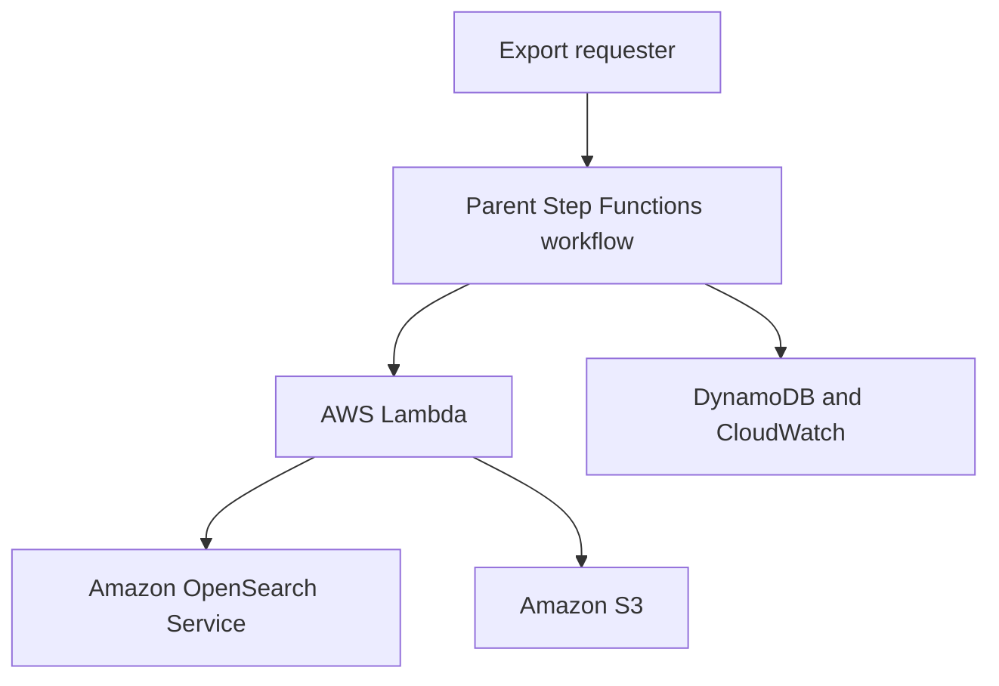
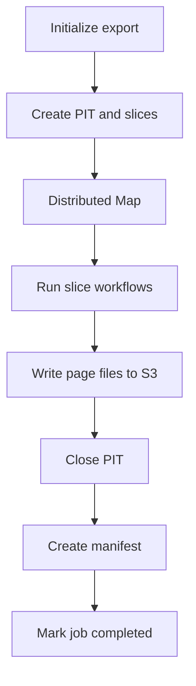
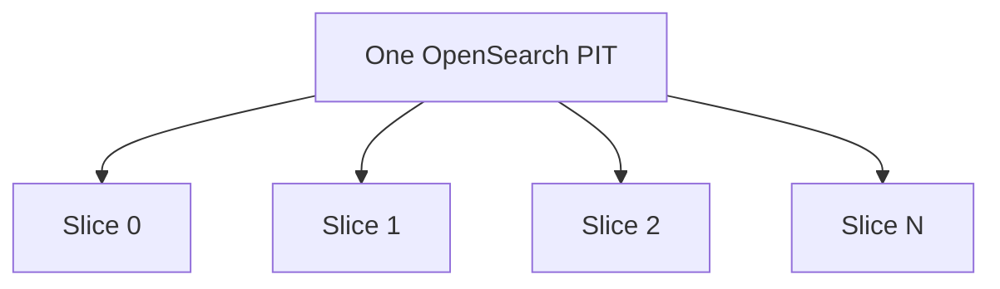
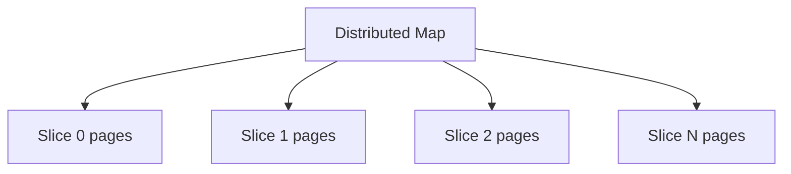
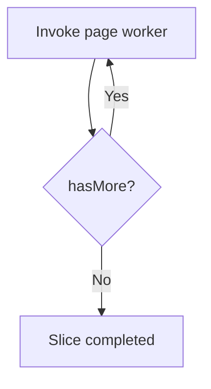
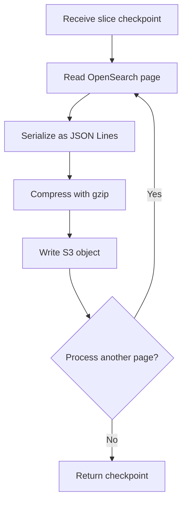
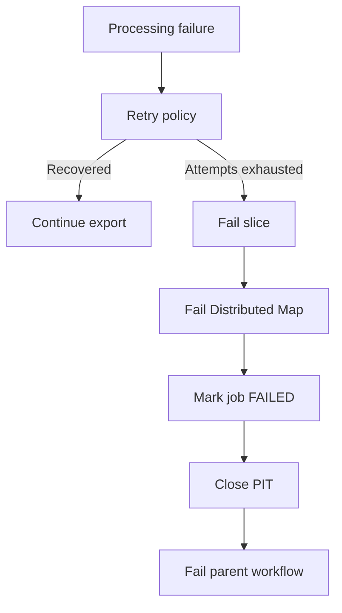
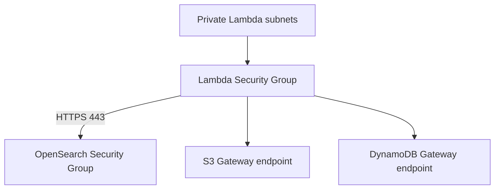

# Architecture

## Purpose

The OpenSearch Export Pipeline exports large query results from Amazon OpenSearch Service to Amazon S3.

The design supports datasets containing thousands of pages while providing:

- consistent reads;
- controlled parallel processing;
- retryable execution;
- idempotent output;
- operational visibility;
- configurable cost and load controls.

## System context



The requester starts the parent State Machine with an OpenSearch index, query, page size, and slice count.

Step Functions controls the process. Lambda functions perform the actual work, while S3 stores the result and DynamoDB stores job metadata.

## Main components

| Component | Responsibility |
|---|---|
| Parent State Machine | Controls the complete export lifecycle |
| Slice State Machine | Processes all pages belonging to one OpenSearch slice |
| Initialize Lambda | Validates the request, creates the job record and PIT |
| Page worker Lambda | Extracts pages and writes compressed files to S3 |
| Cleanup Lambda | Records failures and closes the PIT |
| Finalize Lambda | Validates slice results, writes the manifest, and completes the job |
| OpenSearch | Provides the source documents |
| S3 | Stores page files and the final manifest |
| DynamoDB | Stores job status and idempotency metadata |
| CloudWatch | Stores logs, metrics, and alarms |

## High-level workflow



## Export initialization

The parent workflow first invokes the initialization Lambda.

The initialization Lambda:

1. Validates the export request.
2. Calculates a stable hash of the OpenSearch query.
3. Creates a unique export ID.
4. creates a DynamoDB job record with status `STARTING`.
5. Creates an OpenSearch Point in Time.
6. Updates the job status to `RUNNING`.
7. Generates a list of slice definitions.
8. Returns the initialized export state.

Example slice definitions:

```json
[
  {
    "sliceId": 0,
    "sliceCount": 4
  },
  {
    "sliceId": 1,
    "sliceCount": 4
  },
  {
    "sliceId": 2,
    "sliceCount": 4
  },
  {
    "sliceId": 3,
    "sliceCount": 4
  }
]
```

The documents are not divided or copied during initialization. Each slice definition only describes a logical OpenSearch search partition.

## Point in Time

A Point in Time provides a consistent view of the index for the duration of the export.

Without a PIT, documents could be added, updated, or deleted between page requests. This could cause documents to be skipped, duplicated, or exported in different versions.

All slices use the same PIT:



The PIT is closed after all slices finish or when the export fails.

A lost or expired PIT cannot be replaced while continuing from the previous `search_after` position. A new export must start from the beginning with a new PIT and export ID.

## Pagination

The pipeline uses `search_after` instead of `from` and `size`.

Each OpenSearch response contains sort values for every result. The sort values of the final document become the continuation token for the next request.


Pages inside one slice must be processed sequentially because each page depends on the previous continuation token.

The implementation sorts by `_shard_doc`, which is suitable for efficient PIT export where no external global ordering is required.

## Parallel processing

Parallel processing is implemented through OpenSearch search slices.



Different slices are independent and can run concurrently.

Pages inside one slice remain sequential:

```text
Slice 0: page 0 → page 1 → page 2
Slice 1: page 0 → page 1 → page 2
Slice 2: page 0 → page 1 → page 2
```

## Concurrency controls

The design contains two concurrency limits.

### Distributed Map concurrency

```hcl
max_concurrency = 4
```

This limits how many slice executions Step Functions can process concurrently.

### Lambda reserved concurrency

```hcl
worker_reserved_concurrency = 4
```

This creates an additional protection layer at the Lambda service.

Terraform validates that:

```text
max_concurrency <= worker_reserved_concurrency
```

These values should initially remain conservative and should only be increased after observing OpenSearch CPU, JVM memory pressure, latency, and rejected requests.

## Slice State Machine

Each Distributed Map item starts the Slice State Machine.



The child workflow stores the current checkpoint:

```json
{
  "sliceId": 2,
  "pageNumber": 15,
  "searchAfter": [158734],
  "totalDocuments": 15000,
  "totalFiles": 15,
  "hasMore": true
}
```

The checkpoint is passed to the next Lambda invocation. A separate database record is not required for every page.

## Page worker

One page worker invocation processes a bounded group of pages.



The worker stops when:

- it reaches `MAX_PAGES_PER_INVOCATION`;
- OpenSearch returns the final page;
- OpenSearch returns no documents;
- Lambda approaches its timeout safety margin.

Processing multiple pages per invocation reduces Lambda invocations and Step Functions state transitions.

## State payload boundaries

OpenSearch documents are never returned to Step Functions.

Correct data path:

```text
OpenSearch → Lambda → S3
```

Step Functions receives only metadata:

```json
{
  "sliceId": 2,
  "pageNumber": 15,
  "searchAfter": [158734],
  "totalDocuments": 15000,
  "totalFiles": 15,
  "hasMore": true
}
```

This prevents workflow state payloads from growing with the dataset.

## S3 object layout

```text
exports/<export-id>/
├── data/
│   ├── slice=0000/
│   │   ├── part-000000.jsonl.gz
│   │   └── part-000001.jsonl.gz
│   ├── slice=0001/
│   │   ├── part-000000.jsonl.gz
│   │   └── part-000001.jsonl.gz
│   └── ...
└── manifest.json
```

Each page is stored as a separate compressed JSON Lines file.

Example JSON Lines content:

```json
{"_id":"1","_index":"customers","_source":{"name":"Alice"}}
{"_id":"2","_index":"customers","_source":{"name":"Bob"}}
```

The files do not provide global ordering across slices.

## Idempotency

### Request idempotency

The DynamoDB partition key is `requestId`.

The initialization Lambda uses a conditional write:

```text
attribute_not_exists(requestId)
```

This prevents different Step Functions executions from starting the same logical export twice.

The Step Functions execution ID is also stored with the job. A retry from the same execution can resume initialization, while a different execution receives the existing job result.

### Page idempotency

S3 keys are deterministic:

```text
exports/<export-id>/data/
slice=<slice-id>/part-<page-number>.jsonl.gz
```

If a worker writes an object and then fails before returning its response, Step Functions may retry the worker.

The retry writes the same page to the same key, replacing the previous object rather than creating a duplicate page.

Gzip output uses deterministic metadata so identical input produces identical compressed bytes.

## Failure handling

Temporary failures are retried using exponential backoff and jitter.

Retryable failures include:

- OpenSearch HTTP 429 responses;
- temporary OpenSearch 5xx responses;
- connection timeouts;
- Lambda service failures;
- Lambda throttling;
- Step Functions execution limits.

Permanent failures include:

- invalid OpenSearch queries;
- invalid workflow input;
- missing indexes;
- authorization failures;
- invalid OpenSearch responses;
- missing or expired PIT resources.

## Failure workflow



Partial S3 files remain isolated under the failed export ID. They are not considered a completed dataset because finalization does not complete successfully.

S3 lifecycle rules remove old export objects after the configured retention period.

## Finalization

After all slices complete successfully:

1. The cleanup Lambda closes the PIT.
2. The finalization Lambda validates all slice results.
3. It verifies that every expected slice appears exactly once.
4. It verifies that every slice reports `hasMore = false`.
5. It aggregates document and file counts.
6. It writes `manifest.json`.
7. It updates the DynamoDB status to `COMPLETED`.

Example manifest:

```json
{
  "exportId": "export-123",
  "status": "COMPLETED",
  "indexName": "customers",
  "documentCount": 1000000,
  "fileCount": 200,
  "sliceCount": 16,
  "outputPrefix": "exports/export-123/data/",
  "startedAt": "2026-09-06T08:00:00+00:00",
  "completedAt": "2026-09-06T08:20:00+00:00"
}
```

DynamoDB job status is the authoritative completion state.

## Network architecture



Lambda functions run in at least two private subnets.

The Lambda Security Group permits:

- HTTPS to the OpenSearch Security Group;
- HTTPS to the S3 managed prefix list;
- HTTPS to the DynamoDB managed prefix list;
- DNS inside the VPC.

The OpenSearch Security Group permits HTTPS from the Lambda Security Group.

A NAT Gateway is not required for normal pipeline traffic.

## IAM boundaries

Separate Lambda roles are created for:

- initialization;
- page processing;
- cleanup;
- finalization.

Separate Step Functions roles are created for:

- parent workflow;
- slice workflow.

Examples of permission separation:

| Role | Main permissions |
|---|---|
| Initialize Lambda | DynamoDB job operations, PIT creation and deletion |
| Worker Lambda | OpenSearch search and S3 `PutObject` |
| Cleanup Lambda | DynamoDB update and PIT deletion |
| Finalize Lambda | DynamoDB update and S3 `PutObject` |
| Slice workflow | Invoke the page worker |
| Parent workflow | Invoke auxiliary Lambdas and start child workflows |

The OpenSearch domain access policy and fine-grained access control must independently permit the required Lambda roles.

## Encryption

The default infrastructure provides:

- TLS for OpenSearch and S3 communication;
- S3 server-side encryption;
- DynamoDB server-side encryption;
- private VPC access to OpenSearch;
- blocked S3 public access.

SSE-S3 is used by default to reduce cost and configuration complexity. SSE-KMS can be introduced when customer-managed encryption keys are required.

## Observability

Lambda logs include metadata such as:

- export ID;
- slice ID;
- page number;
- document count;
- compressed size;
- S3 key;
- processing result.

Document bodies, AWS credentials, and complete PIT IDs must not be logged.

CloudWatch alarms monitor:

- Lambda errors;
- worker throttling;
- parent workflow failure;
- parent workflow timeout.

Step Functions execution data logging is disabled by default to avoid recording queries, continuation tokens, or other workflow payloads.

## Scalability

The total number of pages does not directly determine concurrency.

For example:

```text
1,000,000 documents
page size: 1,000
total pages: approximately 1,000

slice count: 16
maximum concurrency: 4
```

Each of the four active slice workflows processes its pages sequentially. When one slice completes, another waiting slice can start.

The design scales by adjusting:

- `pageSize`;
- `sliceCount`;
- `maxConcurrency`;
- `workerReservedConcurrency`;
- `maxPagesPerInvocation`;
- Lambda memory.

These values must be tuned against the target OpenSearch domain.

## Cost considerations

The primary cost and performance concern is OpenSearch load.

Additional pipeline costs come from:

- Step Functions state transitions;
- Lambda duration and invocation count;
- S3 requests and storage;
- DynamoDB requests;
- CloudWatch logs and alarms.

Cost controls include:

- bounded concurrency;
- multiple pages per Lambda invocation;
- gzip compression;
- DynamoDB on-demand billing;
- configurable log retention;
- S3 lifecycle expiration;
- Gateway VPC endpoints;
- no mandatory NAT Gateway;
- no additional queue or streaming service.

## Architectural decisions

### Why Step Functions Standard?

Exports may run longer than a short synchronous operation and require visible execution history, retries, and failure handling.

### Why Distributed Map?

It provides isolated parallel processing of slice items and avoids placing all page activity in the parent workflow history.

### Why two State Machines?

The parent workflow manages the export lifecycle. The slice workflow manages pagination for one slice. This separates responsibilities and keeps the parent workflow understandable.

### Why no SQS?

OpenSearch slicing already provides independent parallel work units, while Step Functions provides scheduling, concurrency control, retries, and progress tracking. SQS would add operational complexity without being required by the current use case.

### Why multiple output files?

S3 does not support appending to an existing object. Multiple immutable files also allow downstream systems to process the dataset in parallel.

### Why JSON Lines?

JSON Lines is easy to stream, compress, inspect, and process independently. Each line represents one OpenSearch document.

## Known limitations

- PIT availability depends on OpenSearch cluster health.
- A lost PIT requires restarting the export.
- Files are not globally ordered across slices.
- OpenSearch load testing is required before increasing concurrency.
- S3 manifest creation and DynamoDB completion update are not an atomic cross-service transaction.
- The current implementation exports document `_source` together with `_id` and `_index`.
- The current implementation does not combine output into one file.
- Cross-account access is not configured.
- The existing OpenSearch domain and VPC are not created by this Terraform configuration.

## References

- [AWS Step Functions documentation](https://docs.aws.amazon.com/step-functions/)
- [AWS Lambda documentation](https://docs.aws.amazon.com/lambda/)
- [Amazon OpenSearch Service documentation](https://docs.aws.amazon.com/opensearch-service/)
- [OpenSearch Point in Time documentation](https://docs.opensearch.org/latest/search-plugins/searching-data/point-in-time/)
- [Terraform AWS provider documentation](https://registry.terraform.io/providers/hashicorp/aws/latest/docs)